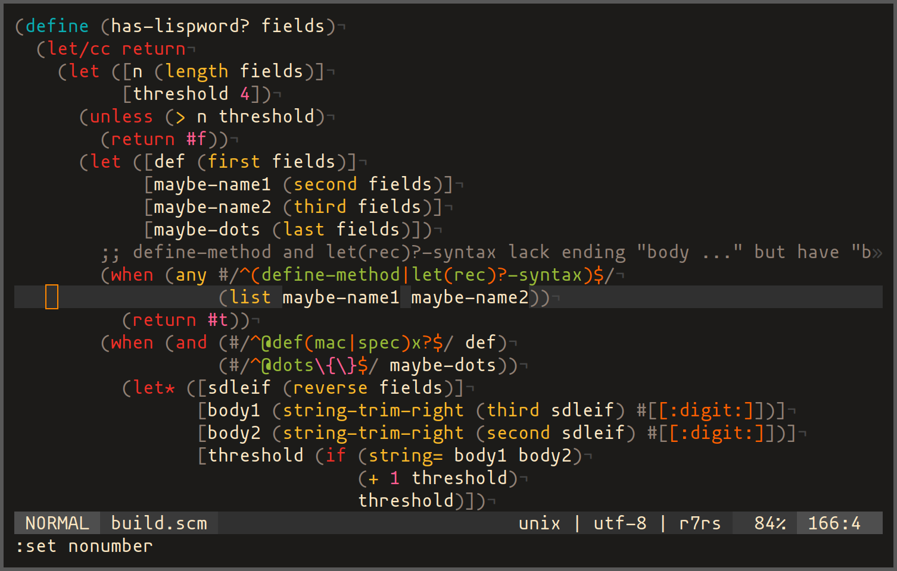

# vim-r7rs-syntax

Vim syntax highlighting for [R7RS Scheme][1] and [Gauche][3].


(with `g:r7rs_use_gauche = 1`)

## Development status

- [x] R7RS-small 
- [ ] R7RS-large
    - [x] `(scheme list)`
    - [x] `(scheme vector)`
    - [x] `(scheme sort)`
    - [x] `(scheme set)`
    - [x] `(scheme charset)`
    - [x] `(scheme hash-table)`
    - [ ] `(scheme ilist)`
    - [ ] `(scheme rlist)`
    - [x] `(scheme ideque)`
    - [ ] `(scheme text)`
    - [x] `(scheme lseq)`
    - [x] `(scheme stream)`
    - [x] `(scheme box)`
    - [x] `(scheme list-queue)`
    - [x] `(scheme ephemeron)`
    - [x] `(scheme comparator)`
    - [ ] `(scheme mapping)`
    - [ ] `(scheme mapping hash)`
    - [ ] `(scheme regex)`
    - [x] `(scheme generator)`
    - [x] `(scheme division)`
    - [x] `(scheme bitwise)`
    - [x] `(scheme fixnum)`
    - [x] `(scheme flonum)`
    - [ ] `(scheme bytevector)`
    - [x] `(scheme vector @)`
    - [ ] `(scheme show)`
- [ ] SRFI
- [ ] Gauche (mostly implemented. See [TODO](TODO.md))

## Installation

Follow usual vim plugin installation procedure.

## Options

For all options below, if both global and buffer local ones are found, the
buffer local one takes precedence.  In the example codes, only global options
`g:...` are shown but `b:...` also works.

### r7rs_strict

This option forces syntax highlighting to obey the Scheme language
specification in R7RS: it restricts use of `[]` and `{}` as parentheses (see
[`g:r7rs_more_parens`](#r7rs_more_parens)) and rejects some identifiers that
could be accepted in the wild (see
[`g:r7rs_strict_identifier`](#r7rs_strict_identifier)).

```vim
let g:r7rs_strict = 1  " default: 0
```

Enabling this option is equivalent to setting

```vim
let g:r7rs_more_parens = ''
let g:r7rs_strict_identifier = 1
let g:r7rs_use_gauche = 0
```

NOTE: If `g:r7rs_strict` is set, the other relevant options are ignored.

### r7rs_more_parens

If square brackets `[]` and curly braces `{}` are included in this option,
they are accepted as additional parentheses.

```vim
let g:r7rs_more_parens = ']}'  " default: ']'
```

It does not care about whether the parens are opening `[{` or closing `]}`.

### r7rs_strict_identifier

If this option is disabled (default), any identifier other than single `.` are
accepted.  If enabled, only those specified in R7RS are accepted: identifiers
starting from digits, containing non-ASCII letters, etc. are rejected.

```vim
let g:r7rs_strict_identifier = 1  " default: 0
```

For more details, see [R7RS][1], sec. 7.1.1 (p. 62) and [the errata][2], 7.

### r7rs_use_gauche

This option enables highlighting for Gauche's extended reader syntaxes
(`#/regexp/`, `#[charset]`, `#"~(interpolated) string"`, ...), numeric
literals (`#12r34_56@78pi`), `:keywords`, `<objects>`, and a bunch of extra
syntaxes/procedures.

```vim
let g:r7rs_use_gauche = 1  " default: 0
```

Enjoy Gauche!

NOTE: If `g:use_gauche` is set, `g:strict_identifier` is ignored since
identifiers in Gauche are not strict (e.g., `1/pi` in `math.const` module).

## License

[MIT](LICENSE)

[1]: https://small.r7rs.org/
[2]: https://small.r7rs.org/wiki/R7RSSmallErrata/
[3]: https://practical-scheme.net/gauche/

<!-- vim: set tw=78 spell: -->
